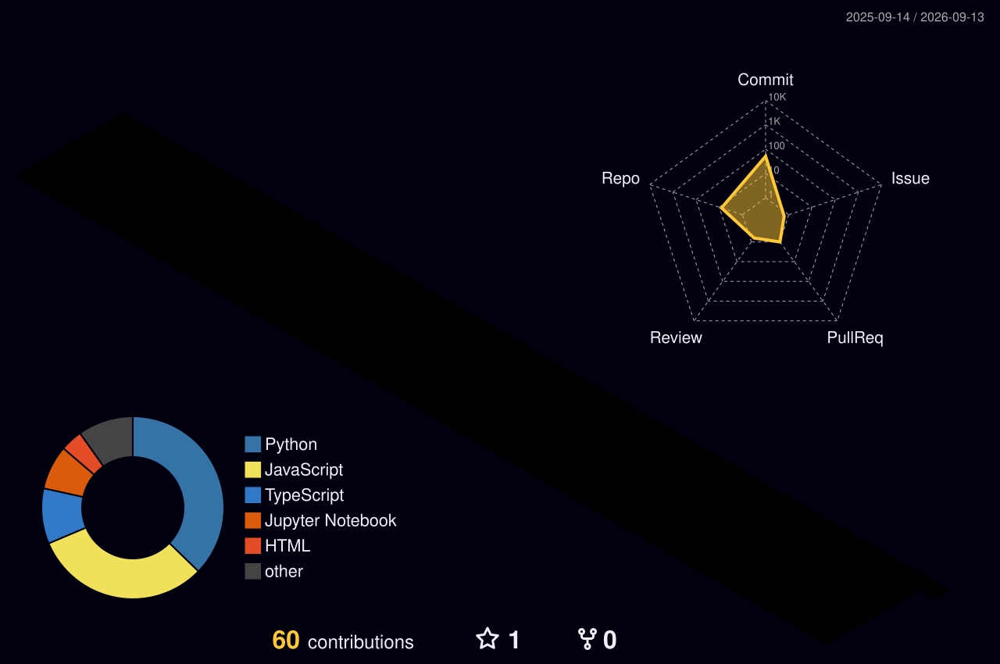

<div align="center">
  

  [](https://git.io/typing-svg)

  [](https://www.linkedin.com/in/nishant-kumar--/) [](mailto:nishantkmrdhn24@gmail.com) 
</div>

## `> whoami`


I'm **Nishant Kumar**, a developer passionate about **Artificial Intelligence, Machine Learning, Data Science, and Full Stack Development**.

I build real-world applications with modern technologies and enjoy combining software engineering with practical AI solutions. I care about systems that are useful, scalable, and thoughtfully engineered.

```python
nishant = {
    "role": "AI/ML & Full Stack Developer",
    "focus": ["Data Science", "Deep Learning", "Generative AI"],
    "craft": ["Scalable AI Applications", "Advanced DSA"],
    "principle": "Learn deeply. Build boldly. Ship responsibly."
}
```

<br clear="right" />

## Tech constellation

<details open><summary><b>Languages</b></summary><br />

    
</details>

<details open><summary><b>AI, machine learning & data</b></summary><br />

      

       
</details>

<details open><summary><b>Full stack, databases & cloud</b></summary><br />

       

       

   
</details>

<details><summary><b>Computer science & developer tools</b></summary><br />

`Data Structures & Algorithms` · `Object-Oriented Programming` · `Problem Solving` · `DBMS` · `Operating Systems` · `System Design`

      
</details>

## Featured missions

<table><tr><td width="50%" valign="top">

### [M/S Sushant Construction](https://github.com/Nishant20361/ms-sushant-construction)
A full-stack construction material management and ordering platform.

`React` `TypeScript` `Express.js` `Prisma` `PostgreSQL`
</td><td width="50%" valign="top">

### [Python AI Assistant](https://github.com/Nishant20361/Python-AI-Assistant)
An AI-powered Python learning assistant supporting English, Hindi, and Hinglish users.

`Python` `Flask` `NLP` `AI` `Machine Learning`
</td></tr><tr><td width="50%" valign="top">

### [WorkForce](https://github.com/Nishant20361/workforce)
A workforce management platform for attendance, salary, payments, and worker management.

`FastAPI` `React` `MongoDB` `Cloudinary`
</td><td width="50%" valign="top">

### [Indian Cricket Face Identification](https://github.com/Nishant20361/indian-cricket-face-identification)
A computer-vision-based face identification system.

`Python` `OpenCV` `Deep Learning` `TensorFlow`
</td></tr><tr><td colspan="2" align="center" valign="top">

### [AI Resume Screener](https://github.com/Nishant20361/ai-resume-screener)
An AI-based resume analysis and candidate ranking system.

`Machine Learning` `NLP` `FastAPI` `React` `Three.js`
</td></tr></table>

## GitHub telemetry

<div align="center">
  
  
  <br />
  <br />
</div>

## Learning orbit

```text
◉ Advanced Data Science      ◉ Deep Learning
◉ Generative AI              ◉ Large Language Models
◉ Advanced DSA               ◉ AI Engineering
```

> **Future goal:** To become an AI Engineer who builds impactful intelligent systems and real-world AI products.

## Contribution universe

<div align="center">
  
  <br /><br />
  <picture><source media="(prefers-color-scheme: dark)" srcset="./profile-3d-contrib/profile-night-rainbow.svg" /><source media="(prefers-color-scheme: light)" srcset="./profile-3d-contrib/profile-gitblock.svg" /></picture>
</div>

---

<div align="center">
  <h3>Let's build something intelligent.</h3>
  <p>Open to meaningful collaborations in AI, machine learning, data science, and full-stack engineering.</p>
  <a href="mailto:nishantkmrdhn24@gmail.com"></a>
  <br /><br />
</div>
